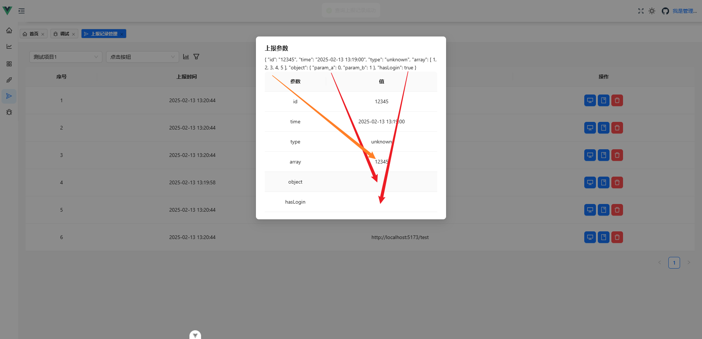
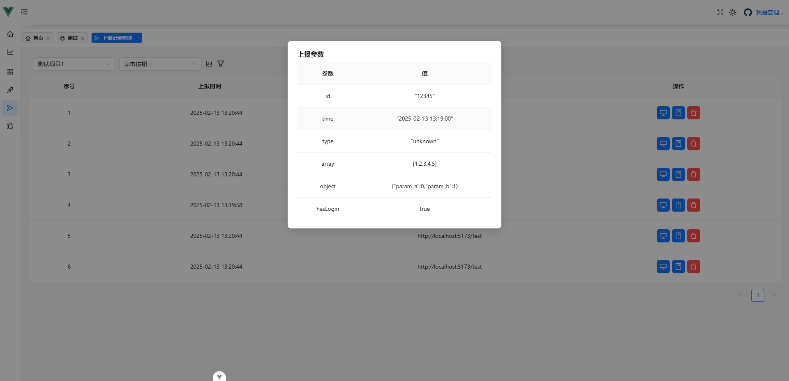
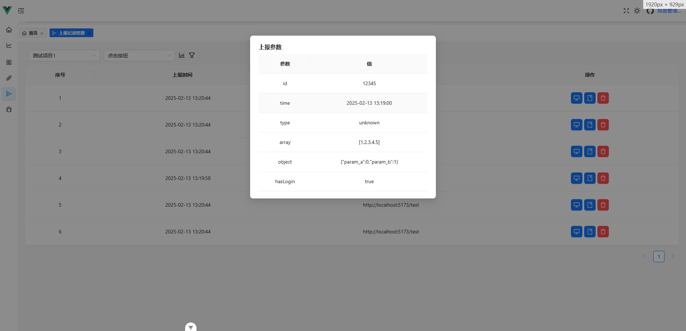

# 记录一些遇到的问题合解决方法


## 1. antd vue的表格无法直接显示`boolean`和`object`类型的事件参数、`Array`显示也有误


:bulb: 解决

把
```ts
// 参数信息
const paramsInfo = computed(() => Object.entries(record.params).map(([name, value]) => ({
    name, value
})))
```
改为
```ts
// 参数信息
const paramsInfo = computed(() => Object.entries(record.params).map(([name, value]) => ({
    name, value: JSON.stringify(value)
})))
```

但这样字符串会多个""，再改为
```ts
// 参数信息
const paramsInfo = computed(() => Object.entries(record.params).map(([name, value]) => ({
    name, value: typeof value === 'string' ? value : JSON.stringify(value)
})))
```
看起来就正常多了
